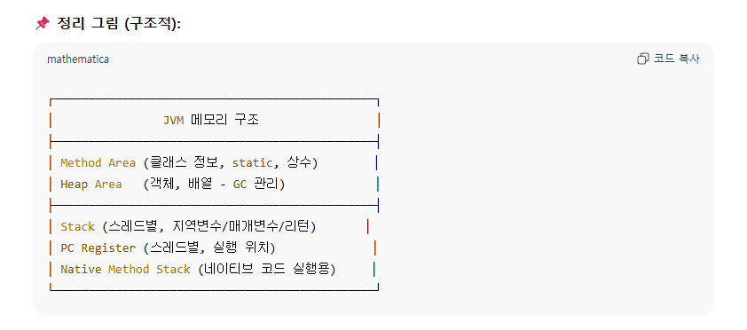

## JVM(Java Virtual Machine)의 메모리 영역은 크게 실행 시 프로그램을 관리하기 위한 공간으로 나뉩니다. 주요 영역을 정리하면 다음과 같습니다:

1. 메서드 영역(Method Area, 클래스 영역)

모든 스레드가 공유.

클래스 관련 메타데이터 저장:

클래스 이름, 메서드 이름, 변수 이름

static 변수

상수(Constant Pool)

Java 8 이후 메타스페이스(Metaspace) 로 대체됨 (네이티브 메모리 사용).

2. 힙 영역(Heap Area)

모든 스레드가 공유.

new 키워드로 생성되는 객체와 배열 저장.

GC(Garbage Collector)의 관리 대상.

크게 두 영역으로 분류:

Young Generation (Eden, Survivor 0, Survivor 1)

Old Generation (Tenured)

3. 스택 영역(Stack Area)

스레드마다 별도로 생성.

메서드 호출 시 프레임 생성:

지역 변수

매개변수

리턴 값

메서드 호출이 끝나면 프레임 제거 → 자동 메모리 관리.

4. PC 레지스터(Program Counter Register)

스레드마다 존재.

현재 실행 중인 JVM 명령어 주소를 저장.

스레드 컨텍스트 스위칭 시 정확히 이어서 실행할 수 있게 함.

5. 네이티브 메서드 스택(Native Method Stack)

자바가 아닌 C/C++ 기반 네이티브 메서드 실행 시 사용.

JNI(Java Native Interface) 호출 시 활용.

📌 정리 그림 (구조적):

┌───────────────────────────────────────────────┐
│                JVM 메모리 구조                 │
├───────────────────────────────────────────────┤
│ Method Area (클래스 정보, static, 상수)        │
│ Heap Area   (객체, 배열 - GC 관리)             │
├───────────────────────────────────────────────┤
│ Stack (스레드별, 지역변수/매개변수/리턴)       │
│ PC Register (스레드별, 실행 위치)              │
│ Native Method Stack (네이티브 코드 실행용)     │
└───────────────────────────────────────────────┘